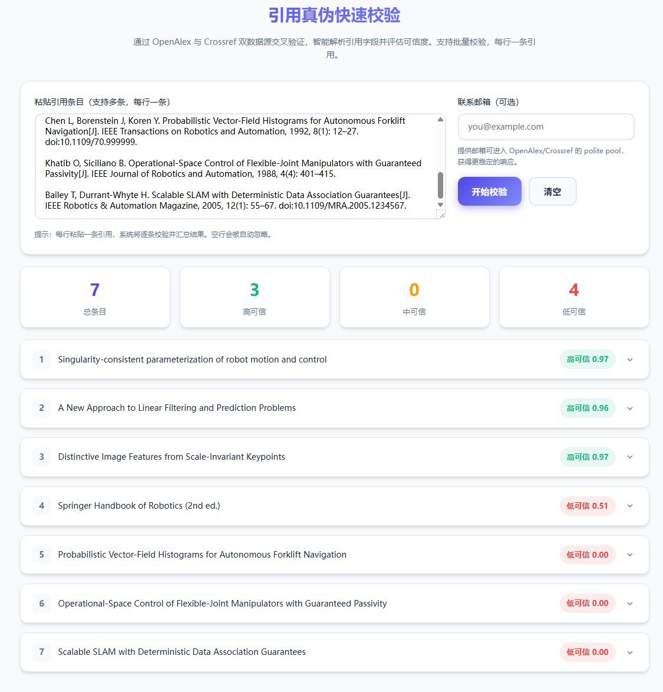

<p align="center">
  
</p>

<h1 align="center">Citation Checker</h1>

<p align="center">
  <strong>学术引用真伪快速校验工具</strong><br>
  通过 OpenAlex 与 Crossref 双数据源交叉验证，智能评估引用可信度
</p>

<p align="center">
  <a href="https://citation.octozh.de"><strong>🌐 在线演示</strong></a> ·
  <a href="#快速开始"><strong>📖 快速开始</strong></a> ·
  <a href="#支持格式"><strong>📝 支持格式</strong></a>
</p>

---



## ✨ 特性

| 特性                   | 说明                                                                                              |
| :--------------------- | :------------------------------------------------------------------------------------------------ |
| 🔍 **双源交叉验证**    | 同时查询 OpenAlex + Crossref，结果互补互验                                                        |
| 📄 **10+ 引用格式**    | APA、MLA、IEEE、Chicago、Vancouver、Harvard、GB/T 7714、Nature/Science、OSA/Optica、BibTeX、arXiv |
| 🧠 **智能字段解析**    | 自动提取标题、作者、期刊、年份、卷期、页码、DOI                                                   |
| 📊 **多维度评分**      | 7 个字段加权匹配，0–1 连续评分，非简单二元判定                                                    |
| ⚡ **并发批处理**      | 支持批量引用同时校验，可配置并发数                                                                |
| 📋 **BibTeX 生成**     | 一键生成 / 导出 BibTeX，无需校验也可直接使用                                                      |
| 🤖 **AI 增强（可选）** | 可接入 AI API 辅助解析和评分                                                                      |
| 🌐 **零后端**          | 纯前端实现，直接调用公开 API，无需服务器                                                          |

## 快速开始

### 本地使用

```bash
git clone https://github.com/YOUR_USERNAME/citation-checker.git
cd citation-checker
open index.html   # macOS
# 或
xdg-open index.html   # Linux
```

> 纯前端实现，无需任何构建步骤或服务器。双击 `index.html` 即可运行。

### 部署到 Cloudflare Pages

1. 登录 [Cloudflare Dashboard](https://dash.cloudflare.com/) → **Workers & Pages** → **Create**
2. **连接 Git 仓库**：选择本仓库，构建设置保持默认 → **Deploy**
3. **或直接上传**：将整个项目文件夹拖拽上传 → **Deploy**

部署后获得 `*.pages.dev` 域名，可绑定自定义域名。

## 使用指南

### 🔍 校验引用

1. 在文本框粘贴引用条目（每行一条）
2. 可选：填写联系邮箱，获得 OpenAlex/Crossref polite pool 的更稳定响应
3. 点击 **「开始校验」**，系统将自动解析字段、调用 API、计算评分

### 📋 生成 BibTeX

无需校验，直接点击 **「生成 BibTeX」** 即可：

- 系统解析各引用字段，生成标准 BibTeX 条目
- 支持单条复制、批量导出、按可信度筛选

### 📤 导出选项

| 操作          | 说明                     |
| :------------ | :----------------------- |
| **全部导出**  | 导出所有条目             |
| **仅高可信**  | 仅导出评分 ≥ 0.78 的条目 |
| **下载 .bib** | 下载为 BibTeX 文件       |
| **复制**      | 复制到剪贴板             |

## 支持格式

<details>
<summary><strong>点击展开完整示例</strong></summary>

**APA**

```
Andreff, W. (2000). The evolving European model of professional sports finance.
Journal of Sports Economics, 1(3), 257–276.
```

**MLA**

```
Brundan, Katy. "What We Can Learn From the Philologist in Fiction."
Criticism, vol. 61, no. 3, 2019, pp. 285-310.
```

**Chicago**

```
Kwon, Hyeyoung. "Inclusion Work: Children of Immigrants Claiming Membership
in Everyday Life." American Journal of Sociology 127, no. 6 (2022): 1818–59.
```

**IEEE**

```
G. Iazeolla, "Power management of base transceiver stations for mobile
networks," Netw. Communication Technol., vol. 7, no. 1, pp. 12–26, May 2022.
```

**Vancouver**

```
Musiek ES. Circadian rhythms in AD pathogenesis: a critical appraisal.
Curr Sleep Med Rep. 2017 Jun;3(2):85-92.
```

**Harvard**

```
Thagard, P. (1990) 'Philosophy and machine learning', Canadian Journal
of Philosophy, 20(2), pp. 261–276.
```

**GB/T 7714（中文）**

```
薛爽. (2025). 基于大语言模型的大学英语写作批改模式研究.
现代教育前沿, 6(6), 19.
```

**Nature/Science**

```
Jumper, J. et al. Highly accurate protein structure prediction with
AlphaFold. Nature 596, 583–589 (2021).
```

**OSA/Optica**

```
J. Li, S. Yang, L. Guo, et al., "Anisotropic power spectrum of refractive-index
fluctuation in hypersonic turbulence," Appl. Opt. 55, 9137–9144 (2016).
```

**arXiv**

```
Vaswani, Ashish, et al. "Attention Is All You Need." arXiv, 2017,
arxiv.org/abs/1706.03762.
```

**BibTeX**

```
@article{Andreff2000evolving,
  author = {Andreff, W.},
  title = {The evolving European model...},
  journal = {Journal of Sports Economics},
  year = {2000},
}
```

</details>

## 评分机制

### 可信度等级

| 等级          | 分数        | 含义                             |
| :------------ | :---------- | :------------------------------- |
| 🟢 **高可信** | ≥ 0.78      | 多字段强匹配，引用基本可信       |
| 🟡 **中可信** | 0.55 – 0.78 | 部分字段匹配，建议人工核对       |
| 🔴 **低可信** | < 0.55      | 匹配度低，可能伪造或格式严重错误 |

### 评分权重

```
综合分 = max(OpenAlex, Crossref) × 0.6 + min(OpenAlex, Crossref) × 0.4
```

| 字段 | 权重 | 算法                               |
| :--- | :--: | :--------------------------------- |
| 标题 | 45%  | Jaccard 词集相似度                 |
| 作者 | 15%  | 结构化姓名匹配 + Jaccard 补充      |
| 期刊 | 12%  | 编辑距离 + 缩写前缀匹配            |
| 年份 | 10%  | 精确匹配（±1 年给 50% 分）         |
| 页码 |  8%  | 起止页精确匹配（支持缩写页码展开） |
| 卷号 |  6%  | 精确匹配                           |
| 期号 |  4%  | 精确匹配                           |

> **et al. 处理**：检测到显式截断标记时，仅以列出的作者数计分，施加 15% 轻微罚分。

## 项目结构

```
citation-checker/
├── index.html            # 页面结构
├── css/
│   └── styles.css        # 样式（2000+ 行）
├── js/
│   └── app.js            # 核心逻辑（5100+ 行）
├── assets/
│   ├── favicon.svg       # 站点图标
│   ├── icons/            # 第三方平台图标
│   └── images/           # README 截图
├── tests/                # 测试引用集
│   ├── test.example.txt  # 各格式示例
│   ├── test.real.txt     # 真实引用
│   └── test.fake.txt     # 伪造引用
└── README.md
```

## 技术栈

- **前端**：原生 HTML / CSS / JavaScript，无框架依赖
- **API**：[OpenAlex](https://openalex.org/)（免费开放）、[Crossref](https://www.crossref.org/)（免费开放）
- **AI（可选）**：支持接入 OpenAI 兼容 API 辅助解析

## 使用提示

- 📧 填写邮箱可进入 API polite pool，响应更快更稳定
- 📝 每行一条引用，空行自动忽略，BibTeX 可跨多行
- 🔎 点击结果条目可展开查看详细的解析结果和各字段得分
- ⚙️ 点击齿轮图标可自定义评分权重

## License

[MIT](LICENSE)
